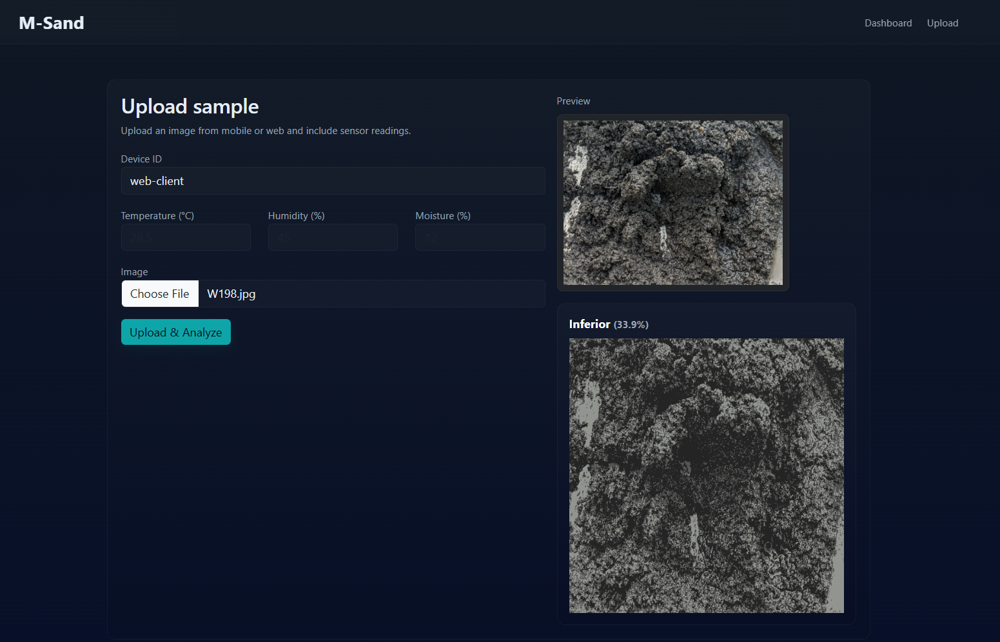

# M-Sand Dashboard Prototype



Contents:

- app.py: Flask application
- requirements.txt: Python dependencies
- utils/: helper modules (image processing, PSD, density)
- templates/: HTML templates (index, dashboard)
- static/: static files (css, uploads)
- database/: SQLite DB (data.db)

Run:

1. Create virtualenv and install dependencies:

   ```bash
   python -m venv venv
   source venv/bin/activate
   pip install -r requirements.txt
   ```

2. Run the app:

   ```bash
   export FLASK_APP=app.py
   export FLASK_ENV=development
   python app.py
   ```

   On Windows PowerShell, use:

   ```powershell
   $env:FLASK_APP = "app.py"
   $env:FLASK_ENV = "development"
   python app.py
   ```

3. Open:
   [http://localhost:5000](http://localhost:5000)

Notes:

- The image processing code uses OpenCV and simple heuristics.
- For production, replace heuristics with trained model and secure endpoints.
